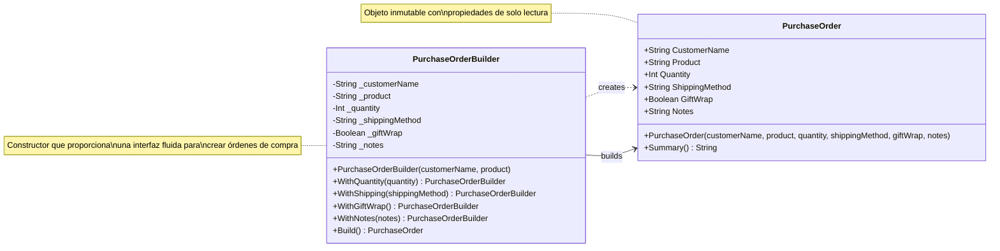

# Diagrama de Clases - OrderApp

## Patrón Builder Implementado

Este diagrama muestra la implementación del patrón Builder para la creación de objetos `PurchaseOrder`.



## Descripción del Patrón

### PurchaseOrder (Producto)
- **Responsabilidad**: Representar una orden de compra inmutable
- **Características**: 
  - Propiedades de solo lectura
  - Validación en el constructor
  - Método Summary() para obtener descripción

### PurchaseOrderBuilder (Constructor)
- **Responsabilidad**: Construir objetos PurchaseOrder de forma fluida
- **Características**:
  - Campos obligatorios en el constructor
  - Métodos With*() que retornan el builder (fluent interface)
  - Valores por defecto razonables
  - Método Build() para crear el objeto final

## Relaciones

- **PurchaseOrderBuilder creates PurchaseOrder**: El builder es responsable de crear instancias de PurchaseOrder
- **Fluent Interface**: Los métodos With*() retornan el propio builder para permitir encadenamiento

## Ejemplo de Uso

```csharp
var order = new PurchaseOrderBuilder("Cliente", "Producto")
    .WithQuantity(2)
    .WithShipping("Express")
    .WithGiftWrap()
    .WithNotes("Entregar en oficina")
    .Build();
```
